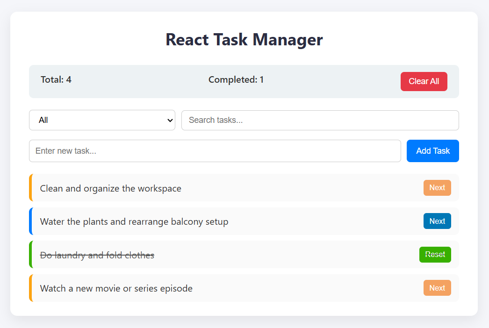

## 🧩 React Task Manager

A simple and modern React Task Manager built using Atomic Design principles.
Features include task creation, status updates, filtering, and persistent storage with localStorage.

👉 **Live Demo:** [https://safeerkilinadan.github.io/react-task-manager](https://safeerkilinadan.github.io/react-task-manager)  

---

## 🚀 Features

🧱 **Atomic Design structure** — (atoms → molecules → organisms → templates → pages)

✅ **Add, update, and clear tasks**

🎨 **Dynamic button styling based on task status**

💾 **Data persistence using localStorage**

📱 **Responsive and minimal UI**

---

## 🖼️ Screenshots

---

## 🛠️ Tech Stack

**React (Vite)**

**JavaScript (ES6+)**

**CSS3**

**localStorage API**

---

## ⚙️ Setup

# Clone the repository
git clone https://github.com/safeerkilinadan/react-task-manager.git

# Navigate into the folder
cd react-task-manager

# Install dependencies
npm install

# Run the app
npm run dev
---

## 🧠 Project Structure
src/
├── components/
│   ├── atoms/
│   ├── molecules/
│   ├── organisms/
│   ├── templates/
│   └── pages/
├── hooks/
│   └── useLocalStorage.js
└── styles/
    └── styles.css
